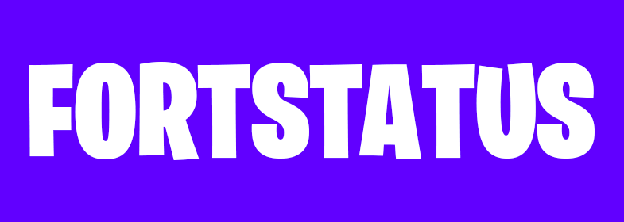

 
  

 
  

  

  <a aria-label="try fortstatus" href="https://fortstatus.netlify.app/"><b>Try in the Browser</b></a>
 |
  <a aria-label="subscribe on youtube" href="https://www.youtube.com/channel/UCdbUT3GEnXld4tzYRZkGVHA">Check out my youtube channel</a>

# Project Install

To run the app in your emulator or device, access https://fortniteapi.io and sing up to generate your API key. Use yout favorite package mananger to install the packages.

`yarn`
or
`npm install`

The key has to be inserted in: <b>src/store/sagas/profile.ts</b>

(If you don't play Fortnine, you can test app using my username😉: akinncar)

# Future Updates

<ul>
  <li>Create Enviroment Variables.</li>
  <li>Fix types in Typescript.</li>
</ul>
